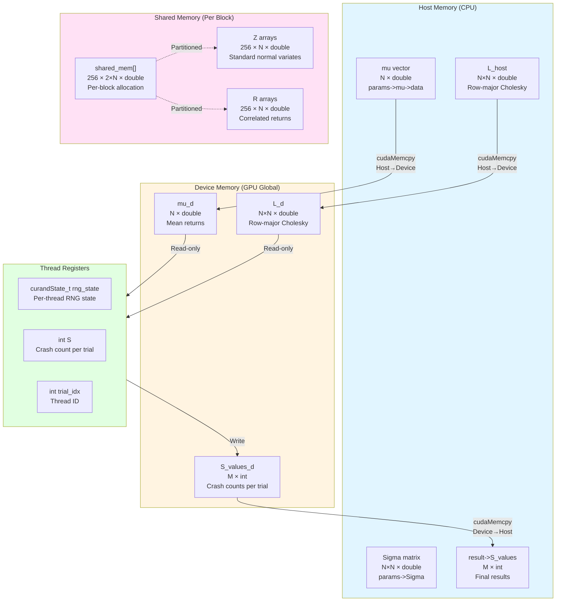

# CUDA Monte Carlo Implementation Analysis

## CUDA Kernel Launch Configuration

**Launch Parameters:**
- **Threads per Block:** 256
- **Number of Blocks:** `(M + 255) / 256` (ceiling division to ensure all M trials are covered)
- **Shared Memory per Block:** `256 × 2 × N × sizeof(double)` bytes
- **Total Threads Launched:** `num_blocks × 256` (may exceed M, guarded by `if (trial_idx >= M) return`)

**Launch Syntax:**
```cuda
monte_carlo_kernel<<<num_blocks, threads_per_block, shared_mem_size>>>(
    M, N, k, x, mu_d, L_d, S_values_d, params->random_seed
);
```

**Example:** For M=10,000 trials:
- Blocks: (10000 + 255) / 256 = 40 blocks
- Total threads: 40 × 256 = 10,240 threads
- Active threads: 10,000 (240 threads exit early due to guard)

---

## Memory Layout Diagram



**Memory Transfer Flow:**
1. **Host → Device:** `mu` (N doubles), `L` (N×N doubles)
2. **Kernel Execution:** Uses shared memory for Z and R arrays, reads from global memory (mu_d, L_d)
3. **Device → Host:** `S_values` (M integers)

---

## GPU Kernel Design Report

The CUDA implementation employs a straightforward parallelization strategy where each thread independently executes one complete Monte Carlo trial. The kernel performs five sequential steps: generating standard normal variates, applying Cholesky transformation for correlation, adding mean returns, counting crashes, and storing results. This design maximizes parallelism by eliminating inter-thread dependencies.

**Thread Hierarchy:** The kernel uses a one-dimensional grid with 256 threads per block, with blocks calculated as `(M + 255) / 256`. Each thread computes its global index via `blockIdx.x * blockDim.x + threadIdx.x`, directly mapping to the trial index for load-balanced execution.

**Memory Management:** Input data (mean vector μ and Cholesky matrix L) are copied to device global memory using `cudaMemcpy` before kernel launch. The Cholesky decomposition is computed on the host using GSL and converted from column-major to row-major for efficient GPU access. Dynamic shared memory is allocated per block for thread-local Z and R arrays, reducing global memory pressure.

**cuRAND:** Each thread maintains an independent cuRAND state initialized with `curand_init(seed, trial_idx, 0, &rng_state)`, ensuring statistical independence across threads. Threads generate N standard normal variates using `curand_normal_double()`, enabling massive parallelization without host-device communication overhead.

**Atomic Operations:** This implementation does not use atomic operations. Each thread writes directly to its unique position `S_values_d[trial_idx]`, eliminating write conflicts. The final reduction (counting extreme events where S ≥ k) is performed on the host CPU after results are transferred back, avoiding GPU-side atomic contention and simplifying the kernel design.

